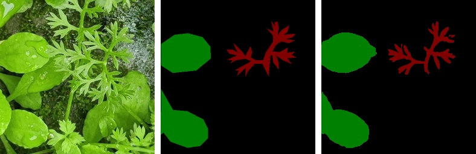
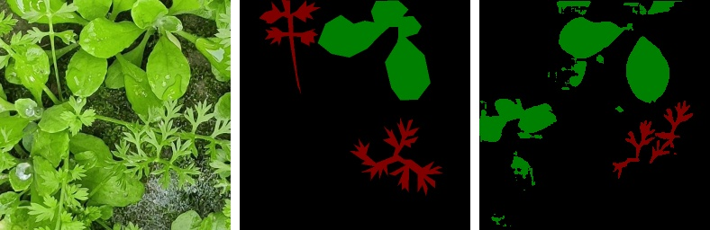
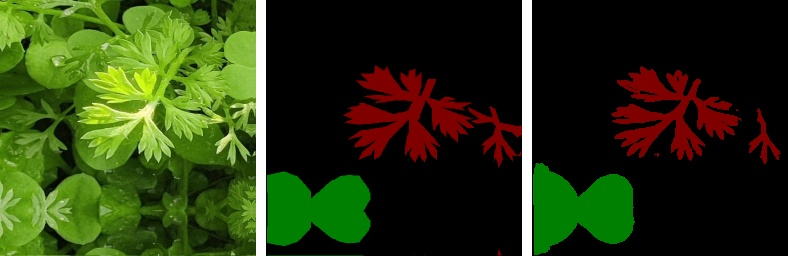

# Multiclass Segmentation in PyTorch

This repository contains PyTorch implementations for multiclass image segmentation using the U-Net architecture. It focuses on segmenting multiclass weeds in agricultural images, demonstrating the effectiveness of deep learning models in precision agriculture.

## Table of Contents

1. [Introduction](#introduction)
2. [Dataset](#dataset)
3. [Architecture](#architecture)
4. [Results](#results)
5. [Contact Me](#contact-me)

## Introduction

Multiclass segmentation is a critical task in computer vision, particularly in scenarios like precision agriculture where accurately identifying and segmenting multiple classes of weeds can improve crop yield and reduce herbicide usage. This repository provides a PyTorch implementation of the U-Net architecture tailored for multiclass segmentation tasks.

## Dataset

The dataset used in this project is the [Multiclass Weeds Dataset for Image Segmentation](https://figshare.com/articles/dataset/Multiclass_Weeds_Dataset_for_Image_Segmentation/22643434?file=40195219), hosted on FigShare. This dataset includes annotated images of agricultural fields with multiple classes of weeds, facilitating supervised learning for segmentation tasks.

## Architecture

## Results

Here are some sample results from the segmentation model: Image, Ground Truth, and Prediction

## Contact Me

If you have any questions, suggestions, or collaboration ideas, feel free to reach out:

- 📧 Email: [nikhilroxtomar@gmail.com](mailto:nikhilroxtomar@gmail.com)  
- 🔗 LinkedIn: [Nikhil Tomar](https://www.linkedin.com/in/nktomar) 
- 🐙 GitHub: [nikhilroxtomar](https://github.com/nikhilroxtomar)

---

Feel free to star ⭐ the repository if you find it useful!
